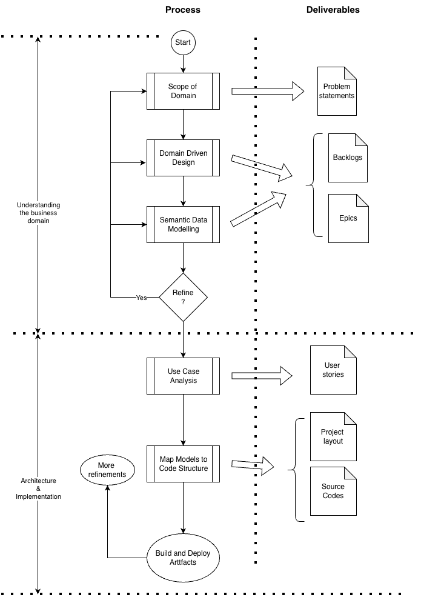
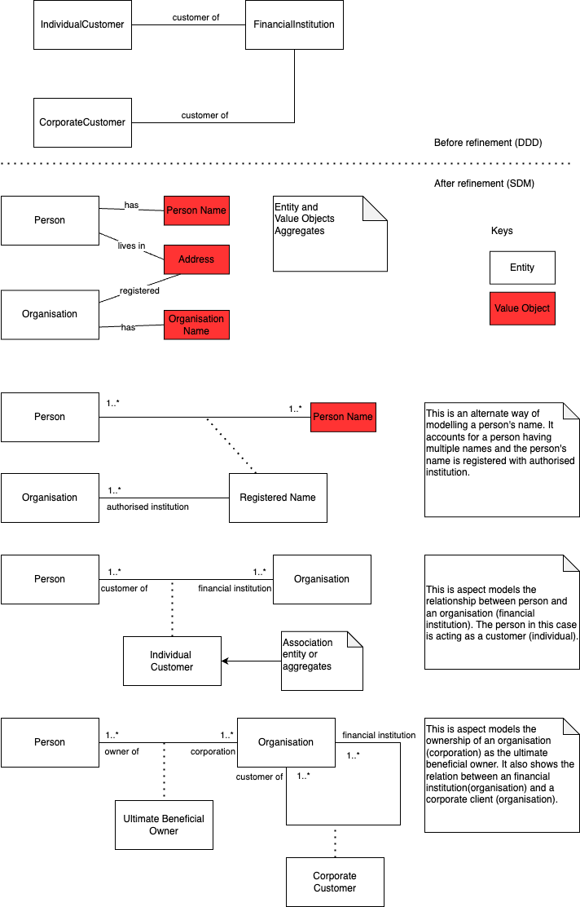
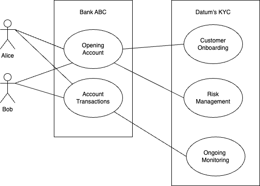
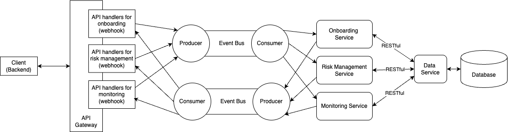
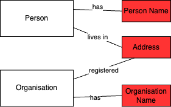
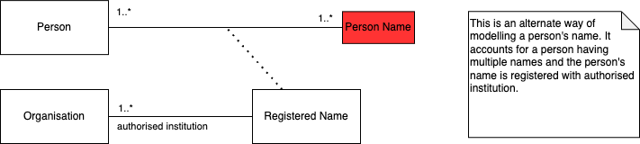

# Designing and Implementing an Extensible Software: A Recommendation

## About this Handbook

This handbook provides a synthesis of knowledge from various sources, compiled by its [contributors](./CONTRIBUTORS). It presents an approach to engineering techniques like Domain-Driven Design (DDD), Semantic Data Modelling (SDM), and architectural patterns to help you design and build extensible software.

In this handbook, you will be taken on a step-by-step journey through a process of designing and implementing extensible software within a hypothetical scenario. The walk-through is presented in two parts: Part I focuses on using analytical techniques to understand the problem space, and Part II demonstrates how to map that analysis to a well-architected solution, covering everything from naming conventions to deployment patterns. Refer to Figure 1 for a summary of the journey you will take.

<figure>
  
  <figcaption>Figure 1: A diagram illustrating the journey you will take.</figcaption></br></br>
</figure>

The process you are about to embark on may seem different from a typical software development process. You will not start with the User Interface (UI) or backend systems as the basis of your analysis. Instead, you will begin by immersing yourself in the business domain, treating it as the main focus of your efforts. This "domain-first" approach is crucial for building extensible and robust systems, as it gives you the basis to match technology with business goals.

Although the journey is depicted as a clear path in Figure 1, real-world application is rarely so linear. The process is iterative, often requiring you to revisit earlier stages. For clarity, this handbook presents each stage as a distinct step, but in practice, the boundaries are much more fluid.

These techniques are suited for systems of any scale, but you will find them most useful for large-scale enterprise systems.

This is not a textbook, but as a living document that will evolve with the ongoing learning and diverse viewpoints of the community.

## Our Hypothetical Scenario

For your journey, imagine you are part of a fictional company, **Datum**. Its mission is to build a centralised system that allows other businesses, like banks or regulated firms, to outsource their complex and critical Know Your Customer (KYC) processes.

At its core, KYC is the essential due diligence process of verifying a client's identity and assessing the potential risks of doing business with them. The primary objective is to prevent a company, like Datum's clients, from being used for illegal activities, such as money laundering or terrorism financing, making it a cornerstone of modern regulatory compliance.

The KYC process is typically built on three core activities:

* **Customer Identification Program (CIP):** The initial step of verifying that customers are who they claim to be.
* **Customer Due Diligence (CDD):** Assessing a customer's risk profile and understanding the purpose of the business relationship.
* **Ongoing Monitoring:** Continuously scrutinizing customer activity to detect suspicious behavior and changes in risk.

KYC is typically conducted by regulated institutions themselves, but in this hypothetical scenario, you will imagine Datum as an outsourcing entity. Third-party institutions will use Datum to verify that their own customers have undergone the necessary KYC, without having to hold customer data themselves. You should bear this scenario in mind, as it influences the outcome of the DDD and SDM analysis; an in-house solution would have a different context.

> Note:
>
> The KYC domain was chosen to illustrate the concepts in this handbook. The intention is **not** to suggest a full, production-ready KYC implementation, but certain aspects presented could be adapted for production use.
>
> The KYC scenario presented is representative of a real-world system and is abbreviated for illustrative purposes.
>
> The software engineering techniques in this handbook are applicable to domains beyond KYC. Future versions will be expanded to include scenarios from other domains.

## Part I: What Problem are you Solving?

In Part I, you will begin with the crucial first step: understanding the problem space our fictional company, Datum, is attempting to solve. This part of the exercise will take you through two key stages.

First, you will understand the nature of the business domain, establishing the boundaries and context for the system you are tasked to build.

Second, you will analyse this domain in depth, relating your findings to the core elements of DDD and SDM. Finally, you will translate your understanding into a clear and precise data model, laying a robust foundation for the solution you will build in Part II.

## Understanding the Problem Space

You will need to survey the landscape to understand the context in which the solution you are building is expected to operate. In the real world, this means immersing yourself, as a software engineer, in the business domain with domain experts.

Imagine you and your team are gathered around a whiteboard, collaboratively brainstorming, sketching diagrams, and capturing conversations to build a shared understanding. Your goal is to ask probing questions and distil the complex processes into a coherent picture.

Assume you have gone through this collaborative process, and the distilled output of your analysis is represented in the following two scenarios. These capture the key aspects of Datum's business domain.

> NOTE:
>
> This discovery phase relies on your creativity and knowledge to derive the problem statement. There are no prescribed techniques.
>
> The following scenarios are illustrative and represent one way of recording such knowledge. They could be recorded and shared as notes among team members in any form. If you are an agile practitioner, you could capture these scenarios as part of a commentary in a product backlog.

### Scenario: Alex Opens a Digital Bank Account

Alex decides to open a new digital-only bank account. The process is entirely online, and the bank, following its KYC protocol, guides Alex through three distinct stages: the CIP, CDD, and Ongoing Monitoring.

**STEP 1:** The Customer Identification Program (CIP)

The first step is for the bank to verify that Alex is who he claims to be. When Alex begins the online application, the bank's system asks for core identifying information: Full legal name, Date of birth, Residential address, and a government-issued identification number.

To verify this information, the system prompts Alex to upload a photo of a government-issued ID and to take a real-time selfie video. The verification technology uses "liveness detection" to confirm that Alex is a real, living person and not a static image or a deepfake.

**STEP 2:** Customer Due Diligence (CDD)

Once Alex's identity is verified, the bank moves on to assess their risk profile. This stage is based on a risk-based approach, ensuring the level of scrutiny is appropriate for the perceived risk. The bank's automated system performs a series of background checks, including screening against global watchlists, checking for adverse media, and checking for Politically Exposed Person (PEP) status.

In this case, Alex is a typical, low-risk customer, so the bank conducts Simplified Due Diligence (SDD). Had Alex been flagged as high-risk, the bank would have been required to conduct an Enhanced Due Diligence (EDD) investigation.

**STEP 3:** Ongoing Monitoring

After the account is opened, the KYC process becomes a continuous obligation. The bank's system continuously monitors Alex's account and transaction activity to detect any changes in their risk profile or suspicious behavior, such as large international transfers to a high-risk jurisdiction.

### Scenario: A Technology Startup, 'Innovate Inc.', Opens a Corporate Account

The founders of Innovate Inc. need to open a corporate bank account. To do so, the bank must conduct a thorough KYC process that includes the CIP, CDD, and Ongoing Monitoring.

**Step 1:** The Corporate Identification Program (CIP)

The first step is to establish that Innovate Inc. is a real, legally-formed entity and to verify its key personnel. The bank requires documents such as articles of incorporation, proof of address, and identification for all authorised signatories. A critical step is identifying the Ultimate Beneficial Owners (UBOs)—the natural persons who ultimately own or control the company.

**Step 2:** Corporate Due Diligence (CDD)

After verifying the company's basic information, the bank's compliance team conducts a deeper risk assessment. The bank screens the company and its key individuals (including UBOs and directors) against global watchlists and adverse media databases. Based on its findings, the bank assigns Innovate Inc. a risk rating. As a new tech startup with no prior suspicious activity, it is assessed as low-risk and undergoes Standard Due Diligence.

**Stage 3:** Corporate Ongoing Monitoring

Once the corporate account is active, a similar process of ongoing monitoring applies. The bank continuously monitors the account's transaction patterns to detect any suspicious activity, such as large wire transfers to a high-risk country unrelated to its declared business.

## Applying Domain-Driven Design

With the problem statement defined, you will now bridge the understanding between business and technical experts through Domain-Driven Design (DDD). In this stage, you will establish a **shared language** that will directly inform the names you use in your code, ensuring the solution aligns with business goals.

Your DDD analysis will unfold in two parts: **Strategic Design** to map the overall business domain, and **Tactical Design** to define the specific building blocks of your system. You can refer to the [Domain-Driven Design: Key Concepts](./topics/domain.md) guide for more details.

### Strategic Design: Defining the Big Picture

Your objective in Strategic Design is to carve the system into well-defined, independent parts called **Bounded Contexts**. Each context is a self-contained sub-domain with its own language and model. To identify these, you should start with first-cut contexts and then move to Tactical Design to see if there are overlapping vocabularies. If so, you will revisit and redraw your boundaries until the artifacts within each are logically clustered.

Assume your analysis has led you to identify three primary Bounded Contexts:

1. **Customer Onboarding Context:** The entry point for new clients, concerned with collecting data and initiating verification.
2. **Risk Management Context:** The central brain for assessing and managing customer risk.
3. **Ongoing Monitoring Context:** Ensures continuous compliance by monitoring transactions and customer information over time.

### Tactical Design: The Building Blocks

Following your Strategic Design, your task in **Tactical Design** is to drill down into each Bounded Context to identify the core building blocks: **Aggregates**, **Entities**, **Value Objects**, and **Domain Events**.

Here are the artifacts you have identified for each context:

#### Customer Onboarding Context

| Artifact | Type | Description |
|---|---|---|
| `Individual Customer` | Entity | Represents an individual person like Alex. |
| `Corporate Customer` | Entity | Represents a company like Innovate Inc. |
| `Ultimate Beneficial Owner (UBO)` | Entity | The natural person who owns or controls the business. |
| `Identity Submitted` | Event | A customer submits their personal data. |
| `Onboarding Completed` | Event | All initial verification checks are complete. |
| `Full Name` | Value Object | A combination of first, middle, and last name. |
| `Residential Address` | Value Object | Contains street, city, postal code, and country. |

#### Risk Management Context

| Artifact | Type | Description |
|---|---|---|
| `Customer Risk Profile` | Entity | Holds a customer's risk score and changes over time. |
| `Risk Assessment Requested` | Event | Triggered after a customer's identity is verified. |
| `Risk Profile Assigned` | Event | An initial risk rating is assigned to the customer. |
| `Risk Score` | Value Object | Contains the assessed risk level (e.g., Low, Medium, High). |

#### Ongoing Monitoring Context

| Artifact | Type | Description |
|---|---|---|
| `Monitoring Alert` | Entity | Created when a suspicious event is detected. |
| `Transaction Deviation Detected` | Event | A customer's transaction pattern deviates from the norm. |
| `Risk Profile Updated` | Event | A customer's risk score changes based on new data. |
| `Transaction Details` | Value Object | Describes a specific transaction (amount, type, etc.). |

## Semantic Data Modelling

With your DDD components defined, your next step is to build a more precise map of the domain using **Semantic Data Modelling (SDM)**. Your task is to establish models that reflect business relationships, distinguishing between core and association entities. For more details, refer to the [Semantic Data Modelling: Core Concepts](./topics/semantic.md) guide.

### Identifying Core Entities and Relationships

Analyzing your entities, you should conclude that `Customer` is a role that exists as a relationship between a `Person` and an `Organisation`. `Person` and `Organisation` are core entities, while `Customer` is an association entity (an **Aggregate** in DDD terms).

You can model this relationship textually or diagrammatically, as shown in Figure 2.

<figure>
  
  <figcaption>Figure 2: A diagrammatic representation of a KYC data model.</figcaption></br></br>
</figure>

## Part II: What is our Implementation Strategy?

In this second part of the handbook, your primary task is to translate the conceptual knowledge gained from Part I into tangible, implementable artefacts. This involves creating the deployable units and source code that will bring your system to life.

To accomplish this, you will need to focus on three critical areas:

1. **Conduct a Use Case Analysis:** Your first step is to model how your expected users, or personas, will interact with the system you intend to build.
2. **Define the Deployment Architecture:** Next, you must decide on how your system will be deployed, considering patterns like the monolith, microservices, or an Event-Driven Architecture (EDA).
3. **Design the Code Architecture:** Finally, your task is to design the layout of the source code to be clean, maintainable, and scalable.

## Use Case Analysis

In this phase, your task is to model the use cases that define how customers (e.g., Alice and Bob) interact with Bank ABC’s system, and how that system, in turn, interacts with Datum’s KYC platform. The three main use cases—Customer Onboarding, Risk Management, and Ongoing Monitoring—are derived directly from the Bounded Contexts you identified earlier. You can model the use cases as depicted in Figure 3.

<figure>
  
  <figcaption>Figure 3: Use case analysis.</figcaption></br></br>
</figure>

## Deployment Architecture

Here, your task is to design the deployment architecture. You can find inspiration in the [Deployment Architectural Patterns](./topics/arch.md) guide. 

Let's assume you have chosen an Event-Driven Architecture (EDA). The DDD event objects you discovered in Part I can inform your event message structure and how you organise events into topics.

<figure>
  
  <figcaption>Figure 4: Deployment Architecture.</figcaption></br></br>
</figure>

## Code Architecture

In this final stage, your task is to translate the conceptual models from your previous work into source code. The primary goal here is to use the outcomes of DDD and SDM as the shared, ubiquitous language for naming components, variables, and other constructs within the code. This practice ensures the implementation remains aligned with business requirements.

You should be aware of a potential challenge: the idiomatic conventions and organisational philosophies of a programming language can sometimes conflict with the structure of the ubiquitous language. For example, a language may favour certain naming conventions that differ from the terms used by domain experts.

For guidance, you can refer to the well-known patterns described in our [Source Code Architecture](./topics/code.md) segment. However, remember that the core goal is to align with the ubiquitous language, so you may need to adjust these patterns accordingly.

Given that it is impossible to establish a single, unified pattern for all languages, this handbook cannot provide universal guidance. Instead, to illustrate the concepts, you will see examples in **SQL** and **Go**.

### Mapping to SQL

Consider the SDM model of a relationship between Entities and value objects as shown in Figure 5. How should you map this to SQL?

<figure>
  
  <figcaption>Figure 5: Person name object values.</figcaption></br></br>
</figure>

Our recommendation is to map this to SQL in a way that gives you a high degree of flexibility.

```sql
-- Table for the 'person' entity.
CREATE TABLE IF NOT EXISTS person (
    id SERIAL PRIMARY KEY,
    person_uuid UUID UNIQUE NOT NULL,
    person_name_id INTEGER,
    residential_address_id INTEGER
);

-- Table for the 'person_name' value object.
CREATE TABLE IF NOT EXISTS person_name (
    id SERIAL PRIMARY KEY,
    first_name TEXT NOT NULL,
    middle_name TEXT,
    surname TEXT NOT NULL
);

-- Table for the 'address' value object.
CREATE TABLE IF NOT EXISTS address (
    id SERIAL PRIMARY KEY,
    building TEXT,
    street TEXT,
    city TEXT,
    county_state TEXT,
    country TEXT
);

-- Add constraints to ensure a 1-to-1 relationship.
ALTER TABLE person ADD CONSTRAINT fk_person_name FOREIGN KEY (person_name_id) REFERENCES person_name(id) ON DELETE CASCADE;
ALTER TABLE person ADD CONSTRAINT unique_person_name UNIQUE (person_name_id);
ALTER TABLE person ADD CONSTRAINT fk_residential_address FOREIGN KEY (residential_address_id) REFERENCES address(id) ON DELETE SET NULL;
ALTER TABLE person ADD CONSTRAINT unique_residential_address UNIQUE (residential_address_id);
```

Alternatively, you could denormalise the tables. However, this would make your schema inflexible. For example, you would not be able to represent a relationship suggesting a person's name has been verified by a government authority. If you revisit your SDM, you will find a model as shown in Figure 6. You can use this as a basis to represent a government-verified name.

<figure>
  
  <figcaption>Figure 6: Verified person name.</figcaption>
</figure></br>

We recommend that you represent Figure 6 in SQL as follows:

```sql
-- Table for the 'organisation' entity.
CREATE TABLE IF NOT EXISTS organisation (
    id SERIAL PRIMARY KEY,
    organisation_uuid UUID UNIQUE NOT NULL,
    organisation_name TEXT NOT NULL
);

-- Table for the 'registered_name' association.
CREATE TABLE IF NOT EXISTS registered_name (
    id SERIAL PRIMARY KEY,
    registered_name_uuid UUID UNIQUE NOT NULL,
    person_id INTEGER NOT NULL,
    person_name_id INTEGER NOT NULL,
    organisation_id INTEGER NOT NULL,
    registered_at TIMESTAMPTZ DEFAULT NOW() NOT NULL
);

-- Add foreign key constraints.
ALTER TABLE registered_name ADD CONSTRAINT fk_registered_name_to_person FOREIGN KEY(person_id) REFERENCES person(id) ON DELETE CASCADE;
ALTER TABLE registered_name ADD CONSTRAINT fk_registered_name_to_person_name FOREIGN KEY(person_name_id) REFERENCES person_name(id) ON DELETE CASCADE;
ALTER TABLE registered_name ADD CONSTRAINT fk_registered_name_to_organisation FOREIGN KEY(organisation_id) REFERENCES organisation(id) ON DELETE CASCADE;

-- Add unique constraint.
ALTER TABLE registered_name ADD CONSTRAINT unique_name_registration_per_org UNIQUE (person_id, person_name_id, organisation_id);
```

### Mapping to Go

When mapping your domain models to Go, you must first address how to structure your project. Go is not a prescriptive language; it does not enforce a single project layout. You can refer to [Organizing a Go module](https://go.dev/doc/modules/layout) for a recommended approach. For this handbook, assume you will adopt an idiomatic Go structure, organising your code into two main directories: `/cmd` and `/internal`. This layout is well-suited to a microservices deployment architecture, where each service has its own `main` package within `/cmd`.

It is worth noting that Go does not encourage deeply nested folder structures. You should keep your folders as flat as possible. One option is to organise your Go project this way:

```text
/cmd
  /onboarding <-- Onboarding context from DDD
    main.go
  /risk <-- Risk management context from DDD
    main.go
  /monitoring <-- Monitoring context from DDD
    main.go
/internal
  /api <-- implementation of API
    doc.go
    router.go
  /person
    doc.go
    entity.go
    sevice.go
    dto.go
  /org
    doc.go
    entity.go
    service.go
    dto.go
  /customer
    doc.go
    entity.go
    service.go
    dto.go
  /pgops <-- this package represents specific postgreSQL operations
    doc.go
    pgops.go
```

It is also important for you to understand Go's concept of packages. Unlike other languages that use namespaces for grouping code, Go uses packages. A key difference is that a Go package represents a single unit of compilation and abstraction; all code within a directory belongs to the same package.

Given this, your package naming convention should be specific. Instead of creating a generic package like `models` or `entities`, you will create packages whose names correspond to the DDD entities you have identified. For example, you will have a `person` package for the Person entity. This approach treats the package itself as a clear unit of abstraction, making the code base easier to navigate and understand.

Here is an example of mapping the `Person` entity to a package named `person`, as shown in Figure 5.

```go
package person

type NamedProfile struct {
    FirstName  string
    MiddleName string
    Surname    string
}
```

Mapping the `Organisation` entity to a package named `org`:

```go
package org

// FinancialInst represents data about a financial institution.
type FinancialInst struct{
    // ...
}

// Regulator represents data about a regulator.
type Regulator struct{
    // ...
}
```

This way of organising your packages allows you to define specialised data types without resorting to typical object-oriented inheritance techniques. You can, for example, easily declare types like `org.FinancialInst` or `org.Regulator`.

## Summary of the Process

In this handbook, we have taken you on a journey through a comprehensive, domain-first approach to software design and implementation. By following the steps we have laid out, you are now equipped to create extensible solutions that align closely with your business goals.

In **Part I**, you began by immersing yourself in the problem domain, using our hypothetical KYC scenario to ground your analysis. We then guided you in applying the principles of **Domain-Driven Design (DDD)**, from using Strategic Design to define your Bounded Contexts, to using Tactical Design to identify your core Aggregates, Entities, and Value Objects. Following this, you used **Semantic Data Modelling (SDM)** to construct a precise, business-aligned data model.

In **Part II**, your focus shifted to implementation. You started with a **Use Case Analysis** to model system interactions and defined a suitable **Deployment Architecture**—in our case, an Event-Driven Architecture. Finally, you explored **Code Architecture**, where we demonstrated how you can translate your conceptual models into tangible code using **SQL** and **Go**, ensuring that the ubiquitous language from your domain analysis is reflected in the implementation.

By embracing this end-to-end process, you can confidently build software systems that are not only robust and maintainable but also deeply connected to the business domain they serve.

## Disclaimer

The content of this repository is for educational purposes only. While the examples are inspired by real-world scenarios, they are simplified for clarity and may not be suitable for production use. The opinions and techniques presented here are intended as learning materials, and their applicability to your own projects is not guaranteed.

## Licence

This work is licensed under a [Creative Commons Attribution-ShareAlike 4.0 International License](http://creativecommons.org/licenses/by-sa/4.0/).