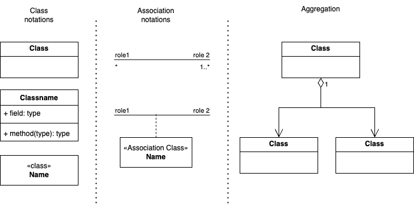

# Semantic Data Modelling: Core Concepts

A Semantic Data Model (SDM) is a conceptual way of organising data that focuses on the meaning and relationships between data elements from a real-world business perspective. Unlike traditional data models that focus on the technical structure of tables and columns, an SDM is designed to be easily understood by both business users and machines.

## Core Principles of Semantic Data Modelling

An SDM is built on these key principles:

* **Focus on Business Concepts:** The model uses a common business language to define entities, which are real-world objects like a customer, a product, or an order.
* **Meaningful Relationships:** Modelling relationships between these entities in business terms. For example, a "person" places an "order" for a "product." - "order" is a business relationship.
* **Abstraction:** An SDM hides the underlying technical complexity of how data is stored. Users can interact with the data using familiar business terms without needing to understand the database's physical structure.
* **The "Thing-in-Itself"** vs. **"The Role"**: The **concrete entity** is the `thing-in-itself`. A human being is a human being, a physical person with certain attributes (name, date of birth, etc.). The role is the part that entity plays in a specific context. For example:

  * Concrete Entity: `Human`
  * Relationship: `logs into`
  * Role: `User`

This is a much more flexible and accurate way to model the real world. Why is this important?

* **Reusability:** The Human entity can be reused in many different contexts. That same human can also be an Applicant for a job, a Customer making a purchase, or a Student taking a class. By modelling the Human as a concrete entity and the User, Applicant, Customer, and Student as roles, you avoid creating redundant entities and attributes.
* **Clarity and Precision:** It clarifies the model by explicitly stating what the relationship is. When you say, "A Human plays the role of User in the context of Application access," it's much clearer than simply saying, "A User logs in."
* **Extensibility:** As new business processes emerge, you can simply add new roles to your existing concrete entities. For instance, if your application introduces a new "admin" feature, you don't need to create a new Admin entity from scratch. You can simply say, "A Human can also play the role of Administrator."

## Steps in Semantic Data Modelling

Semantic data modelling is a process of progressive refinement, moving from a high-level sketch to a more precise and meaningful model. Here’s a typical workflow:

1. **Produce a Rough-Cut Model:** Start by creating an initial model of the entities and relationships using everyday language, based on your initial understanding of the domain. For example, you might start with simple concepts like `Author` and `Book` and a relationship like `writes`.
2. **Establish the Semantics and Refine the Model:** This is the core of the process. Critically examine the terms used in your initial model and refine them to be more semantically accurate. This is where you would distinguish between a core entity and the role it plays. For example, you might realise that `Author` is a role played by a `Person`, and you would update your model to reflect this deeper understanding.
3. **Define Relationships and Cardinality:** Once your entities are well-defined, formalise the relationships between them. This includes giving the relationships clear, descriptive names and defining their cardinality (e.g., one-to-one, one-to-many, many-to-many).
4. **Choose a Modelling Technique:** Select a suitable technique to represent your model. This could be a visual notation like UML, a formal language like RDF/OWL, or a simpler, more informal approach like the Subject-Predicate-Object triples shown in the example.
5. **Iterate and Refine:** Semantic modelling is not a one-time task. It is an iterative process of continuous learning and refinement. As you gain new insights into the domain, you should revisit and improve your model in collaboration with domain experts.

## A Simplified Example: Modelling the World of Books

This section will walk through the process of creating a semantic model for some basic information about books, following the steps outlined above.

### Step 1: Produce a Rough-Cut Model

Our initial, high-level understanding of the domain might look like this:

* **Entities:** `Author`, `Book`
* **Relationship:** An `Author` *writes* a `Book`.

This serves as a suitable starting point. It captures the most obvious concepts and their relationship.

### Step 2: Establish the Semantics and Refine the Model

Now, we critically examine our initial model. Is `Author` a fundamental entity, or is it a role? A person can be an author, but they are fundamentally a `Person`. This distinction is crucial for a rich semantic model.

So, we refine our model:

* **Core Entities:** `Person` and `Book`
* **Role:** `Author` (a role that a `Person` can play)
* **Refined Relationship:** A `Person` (in the role of an `Author`) *writes* a `Book`.

### Step 3: Define Relationships and Cardinality

Now we formalise the relationships:

* A `Person` can write one or more `Book`s (`1..*`).
* A `Book` can be written by one or more `Person`s (to allow for co-authorship) (`1..*`).

### Step 4: Choose a Modelling Technique

* [Subject Predicate Object Notations](#subject-predicate-object-notation)
* [UML Notations](#uml-notations)

#### Subject Predicate Object notation

* **Instance of a Person:**
  * Subject: `Person:JaneAusten`
  * Predicate: `hasName`
  * Object: `Jane Austen`
* **The Role of the Person:**
  * Subject: `Person:JaneAusten`
  * Predicate: `playsRole`
  * Object: `Role:Author`
* **Instance of a Book:**
  * Subject: `Book:PrideAndPrejudice`
  * Predicate: `hasTitle`
  * Object: "Pride and Prejudice"
* **The Relationship:**
  * Subject: `Book:PrideAndPrejudice`
  * Predicate: `wasWrittenBy`
  * Object: `Person:JaneAusten`

#### UML Notations

Unified Modelling Language (UML) is a modelling language capable of supporting structural modelling (i.e. classes, class and association) and a host of others.

An element of UML is an `association class`. For example, the `authorship` role could be modelled as an `association class` between `Person` and `Book`, and it could have properties like `publicationDate` or `royaltyPercentage`.

### Step 5: Iteration and Refinement

By following these steps, we've moved from a simple, surface-level model to a more semantically rich and accurate representation of the domain.

## DDD vs Semantic Data Model

| DDD | Semantic Data Model |
| --- | --- |
| Entity | Entity |
| Aggregate | Association Entity (Class) |
| Value Objects | Properties  |
