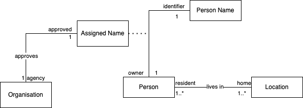

# Person Identity System

In this domain we are modeling a peronal identifier system.

## Scenario

1. A person is a human.
1. A person is identified by a named identifier that comprise of first name and surname.
1. A person could change names via Deed Poll registered with a trusted institution -- e.g. The Royal Court of Justice.
1. A person could register his residence in multiple locations.

## Entity Relationship

Here is an entity relationship model that reflect the description of the domain scenario.

