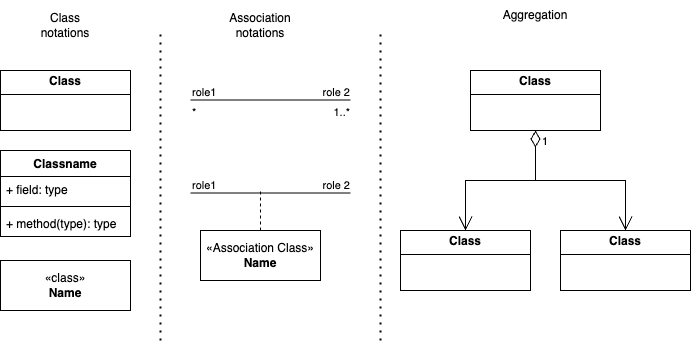
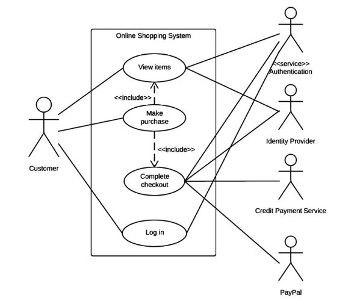
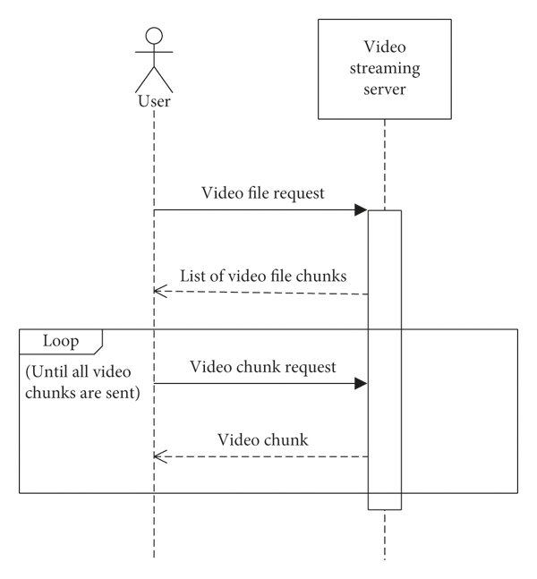

# UML Notations

The Unified Modeling Language (UML) is a general-purpose visual modeling language used to visualize, specify, construct, and document the artifacts of software systems.

## Structural Notation

* [Diagrammatic](#diagrammatic-structural-notations)
* [PlantUML](#plantuml-structural-notations)

### Diagrammatic structural notations



### PlantUML structural notations

```uml
@startuml
' Basic Class with Name
class ClassName

' Class with Attributes
class Person {
  + name: String
  - age: Integer
  # address: String
}

' Class with Operations (Methods)
class Calculator {
  + add(int a, int b): int
  - subtract(int a, int b): int
  # multiply(int a, int b): int
}

' Class with both Attributes and Operations
class Car {
  + model: String
  - speed: Integer
  --
  + accelerate(): void
  + brake(): void
  - getCurrentSpeed(): Integer
}

' Abstract Class (italicized name)
abstract AbstractClass {
  abstractMethod()
}

' Interface (with <<interface>> stereotype)
interface MyInterface {
  methodA()
  methodB()
}

' Class implementing an Interface (using --|)
class ConcreteClass implements MyInterface

ConcreteClass --| MyInterface

' Inheritance (using --|> )
class ChildClass extends ParentClass
ParentClass <|-- ChildClass

' Association (simple line)
class Customer
class Order
Customer -- Order

' Directed Association (arrow indicates direction)
class User
class Role
User --> Role : has

' Association with Multiplicity
class Library
class Book
Library "1" -- "*" Book : contains

' Aggregation (hollow diamond)
class Department
class Employee
Department o-- "*" Employee : employs

' Composition (filled diamond)
class House
class Room
House *-- "*" Room : has

@enduml
```

Association class.

```uml
@startuml
class Student
class Course
class Enrollment {
  + grade: String
  + enrollmentDate: Date
}

Student "*" -- Enrollment
Course "*" -- Enrollment
Student --o "enrolls in" Course
@enduml
```

## Use Case

* [Diagrammatic representation](#diagrammatic-use-case)
* [PlantUML representation](#plantuml-use-case)

### Diagrammatic use case



### PlantUML use case

Actors definition:

```uml
@startuml
actor User
actor "Admin User" as Admin
actor ":System:" as System  ' Using quotes and alias for names with spaces or special characters
@enduml
```

Use case definition:

```uml
@startuml
usecase "Login to System" as Login
usecase "View Dashboard"
usecase "Edit Profile Details" as Edit
@enduml
```

Association between actors and use cases

```uml
@startuml
actor User
usecase "Login to System" as Login
usecase "View Dashboard"

User -- Login
User -- View Dashboard
@enduml
```

## Sequence Notations

* [Diagrammatic representation](#digrammatic-squence)
* [PlantUML representation](#plantuml-sequence)

### Digrammatic squence



### PlantUML sequence

```uml
@startuml
title Sequence Diagram: User Authentication

actor User
participant "Web Browser" as Browser
participant "Web Server" as Server
participant "Authentication Service" as AuthDB

User -> Browser: Requests login page
Browser -> Server: GET /login
Server -> Browser: Returns login form (HTML)
Browser -> User: Displays login form

User -> Browser: Enters username and password
Browser -> Server: POST /authenticate (username, password)
Server -> AuthDB: Queries user credentials (username, password)
AuthDB -> Server: Returns authentication result (success/failure)

alt Authentication Successful
  Server -> Browser: Redirects to home page
  Browser -> User: Displays home page
else Authentication Failed
  Server -> Browser: Returns error message
  Browser -> User: Displays error message
end

@enduml
```
